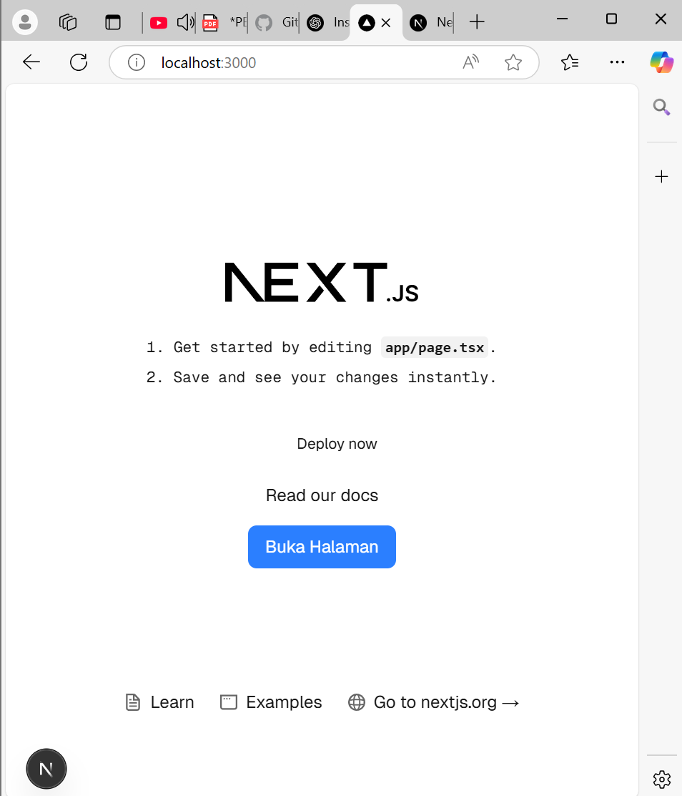

*** LAPORAN PRAKTIKUM 1 ***

|        |   Pemrograman Berbasis Framework   |
|--------|------------------------------------|
|Nama    | Ratnasari                          |
|NIM     | 2241720007                         |
|Kelas   | TI-3B                              |
|Absen   | 18                                 |
|Tugas   | Pertemuan 1                        |

Praktikum 1 
1.	Jelaskan kegunaan masing-masing dari Git, VS Code dan NodeJS yang telah Anda install pada sesi praktikum ini! 
Jawaban : 
-	Git : git digunakan untuk melacak perubahan kode, penyimpanan Riwayat perubahan kode dan bisa mengembalikan versi kode sebelumnya jika terjadi kesalahan dalam pengembangan perangkat lunak. Jadi mempermudah pengelolaan proyek dengan terintegrasi pada platform lain seperti GitHub dan GitLab.
-	VS Code : text editor yang mendukung berbagai Bahasa pemrograman. Mmeiliki banyak ekstensi dan terminal bawaan dan mendukung git jadi mempermudah pengelolaan kode dengan Git. 
-	NodeJS : runtime JavaScript yang memungkinkan eksekusi kode JavaScript di luar browser, Memiliki NPM (Node Package Manager). 
2.	Buktikan dengan screenshoot yang menunjukkan bahwa masing-masing tools tersebut telah berhasil terinstall di perangkat Anda! 
Jawaban : 
-	Git

- VS Code 

-Nodejs

Praktikum 2 
1.	Pada Langkah ke-2, setelah membuat proyek baru menggunakan Next.js, terdapat beberapa istilah yang muncul. Jelaskan istilah tersebut, TypeScript, ESLint, Tailwind CSS, App Router, Import alias, App router, dan Turbopack! 
Jawaban : 
-	TypeScript : Superset dari javascript yang memiliki fitru static type-checking
-	ESLint : Linter untuk memeriksa serta memperbaiki kode javascript/typescript
-	Tailwind CSS : framework css dengan basis utility
-	App router : system routing berbasis folder dan file
-	Import Alias : menyederhanakan path import dengan @/ sebagai alias dari src/
-	Turbopack : Bundler(alat yang menggabungkan berbagai file kode) baru di Next.js yang lebih cepat dari webpack untuk development
2.	Apa saja kegunaak folder dan file yang ada pada struktur proyek React yang tampil pada gambar pada tahap percobaan ke-3! 
 
Jawaban : 
 
-	.next/  : Folder hasil build Next.js yang berisi file sementara untuk caching, optimasi, dan rendering.
-	App/ : folder utama untuk halaman dan routing di next.js
-	Node_modules/ : Berisi semua package dan dependensi yang diinstal melalui npm
-	Public/ : berisi asset yang bisa diakses langsung dari URL /public
-	.gitignore : File yang berisi daftar file/folder yang tidak perlu di-track oleh Git (misalnya node_modules/, .next/).
-	next-env.d.ts :File deklarasi TypeScript untuk Next.js agar mendukung fitur bawaan dengan baik.
-	Next.config.ts : file konfigurasi utama yang digunakan untuk mengatur fitur.
-	Package.json : untuk manajemen dependensi, skrip npm dan informasi proyek
-	Package-lock.json : File otomatis yang dibuat oleh npm untuk mencatat versi pasti dari semua dependensi yang terinstal.
-	Postcss.config.mjs : File konfigurasi untuk PostCSS, biasanya digunakan bersama Tailwind CSS atau CSS processing lainnya.
-	README.md : Dokumen berisi informasi atau petunjuk terkait proyek.
-	Tsconfig.json : File konfigurasi TypeScript untuk menentukan aturan kompilasi kode TypeScript di dalam proyek.
3.	Buktikan dengan screenshoot yang menunjukkan bahwa tahapan percobaan di atas telah berhasil Anda lakukan! 
Jawaban : 
-	Tampilan Terminal setelah npx create-next-app selesai 
 
-	Struktur folder di VS Code 
  
-	Hasil di browser http://localhost:3000/ setelah npm run dev
 
 
Praktikum 3 
1.	Buktikan dengan screenshoot yang menunjukkan bahwa tahapan percobaan di atas telah berhasil Anda lakukan! 
Jawaban :

Praktikum 4 
1.	Untuk apakah kegunaan sintaks user.imageUrl? 
Jawaban : 
Sintaks user.imageUrl digunakan untuk mengakses properti imageUrl dari objek user. Dalam konteks kode yang kamu buat, user.imageUrl digunakan sebagai sumber gambar (src) dalam elemen .
2.	Buktikan dengan screenshoot yang menunjukkan bahwa tahapan percobaan di atas telah berhasil Anda lakukan! 
Jawaban : 

 
