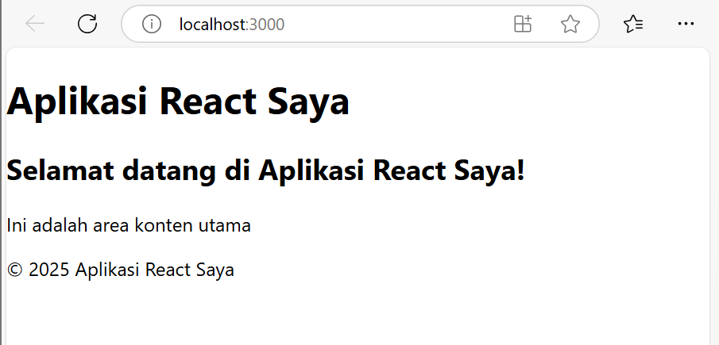
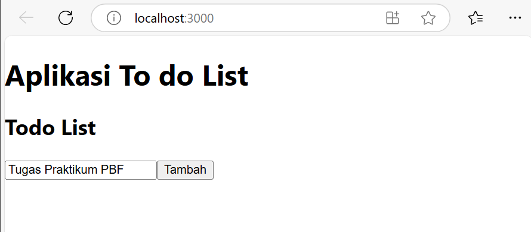

*** LAPORAN PRAKTIKUM 2 ***

|        |   Pemrograman Berbasis Framework   |
|--------|------------------------------------|
|Nama    | Ratnasari                          |
|NIM     | 2241720007                         |
|Kelas   | TI-3B                              |
|Absen   | 18                                 |
|Tugas   | Pertemuan 2                        |

LANGKAH-LANGKAH PRAKTIKUM
1. Persiapan Lingkungan


2. Membuat Komponen React
``` dart
import React from 'react';

// Komponen Header
function Header() {
  return (
    <header>
      <h1>Aplikasi React Saya</h1>
    </header>
  );
}

// Komponen Main
function Main() {
  return (
    <main>
      <h2>Selamat datang di Aplikasi React Saya!</h2>
      <p>Ini adalah area konten utama</p>
    </main>
  );
}

// Komponen Footer
function Footer() {
  return (
    <footer>
      <p>&copy; 2025 Aplikasi React Saya</p>
    </footer>
  );
}

// Komponen App yang menggunakan Header, Main, dan Footer
function App() {
  return (
    <div>
      <Header />
      <Main />
      <Footer />
    </div>
  );
}
export default App;
```
Hasil :



3. Menggunakan JSX untuk Membuat Komponen Dinamis 
    - Counter.js
    ``` dart
        import React, { useState } from 'react';

        function Counter() {
        const [count, setCount] = useState(0);
        function handleClick(){
            setCount(count + 1);
        }

        return (
            <div>
            <p>Hitungan: {count}</p>
            <button onClick={handleClick}>Tambah</button>
            </div>
        );
        }

        export default Counter;
    ```
    - tambahkan pada src/App.js
    ``` dart
        import Counter from './Counter'; 


        function App() {
        return (
            <div>
            <Header />
            <Main />
            // <Counter />
            <TodoList />
            <Footer />
            </div>
        );
        }
    ```
    hasil :
    


4. Menggunakan Props untuk Mengirim Data 
    - Greeting.js 
    ``` dart
        function Greeting(props) {
        return <h1>Hallo, {props.name}!</h1>;
        }
        
        export default Greeting; // ✅ Tambahkan ini
        
    ```
    - src/App.js
    ``` dart
        import Greeting from './Greeting';

        function App() {
        return (
            <div>
            <Header />
            <Main />
            //<Greeting name="John" />
            // <Counter />
            <Footer />
            </div>
        );
        }
    ```
    -Hasil :
    


5. Menggunakan State untuk Mengelola Data 
    - src/App.js
    ``` dart
        function Example(){
        const [name, setName] = useState('');
        const [age, setAge] = useState(0);
        const [email, setEmail] = useState('');

        const handleNameChange = (e) => {
            setName(e.target.value);
        }
        const handleAgeChange = (e) => {
            setAge(e.target.value);
        }
        const handleEmailChange = (e) => {
            setEmail(e.target.value);
        }

        return (
            <div>
            <input type='text' placeholder='Nama' value={name} onChange={handleNameChange}/>
            <input type='number' placeholder='Umur' value={age} onChange={handleAgeChange}/>
            <input type='email' placeholder='Email' value={email} onChange={handleEmailChange}/>
            <p>{name} berumur {age} tahun dan emailnya adalah {email}.</p>
            </div>
        );
        }
    ```
    ``` dart
        function App1() {
            return (
                <div>
                <Header />
                <Main />
                //<Greeting name="John" />
                // <Counter />
                // <Example />
                <h1> Aplikasi To do List</h1>
                <TodoList />
                <Footer />
                </div>
            );
        }
    ```
    - hasil :
    


Tugas 
1. Buat komponen baru bernama TodoList yang menampilkan daftar tugas (todo list). Gunakan 
state untuk mengelola daftar tugas dan props untuk mengirim data tugas ke komponen anak. 
2. Tambahkan fitur untuk menambahkan tugas baru ke dalam daftar menggunakan form input. 
3. Implementasikan fitur untuk menghapus tugas dari daftar.
tambahkan file TodoItem.js dan TodoList.js

TodoItem.js
``` dart
    // src/TodoItem.js
    import React from "react";

    function TodoItem({ task, onDelete }) {
    return (
        <li>
        {task}
        <button onClick={onDelete} style={{ marginLeft: "10px" }}>Hapus</button>
        </li>
    );
    }

    export default TodoItem;

```

TodoList.js
``` dart
            // src/TodoList.js
        import React, { useState } from "react";
        import TodoItem from "./TodoItem";

        function TodoList() {
        const [tasks, setTasks] = useState([]); // State daftar tugas
        const [newTask, setNewTask] = useState(""); // State untuk input tugas baru

        // Tambah tugas baru
        const addTask = () => {
            if (newTask.trim() === "") return;
            setTasks([...tasks, newTask]); // Menambahkan tugas ke daftar
            setNewTask(""); // Reset input
        };

        // Hapus tugas berdasarkan indeksnya
        const deleteTask = (index) => {
            const updatedTasks = tasks.filter((_, i) => i !== index);
            setTasks(updatedTasks);
        };

        return (
            <div>
            <h2>Todo List</h2>
            <input
                type="text"
                placeholder="Tambahkan tugas..."
                value={newTask}
                onChange={(e) => setNewTask(e.target.value)}
            />
            <button onClick={addTask}>Tambah</button>

            <ul>
                {tasks.map((task, index) => (
                <TodoItem key={index} task={task} onDelete={() => deleteTask(index)} />
                ))}
            </ul>
            </div>
        );
        }

        export default TodoList;

```


hasil :




