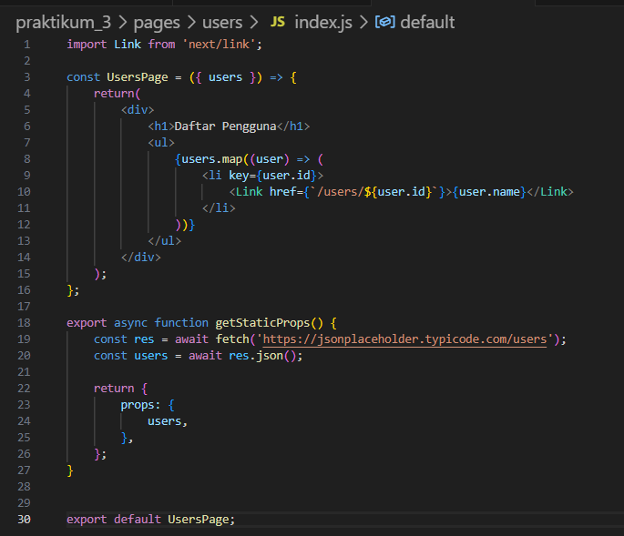
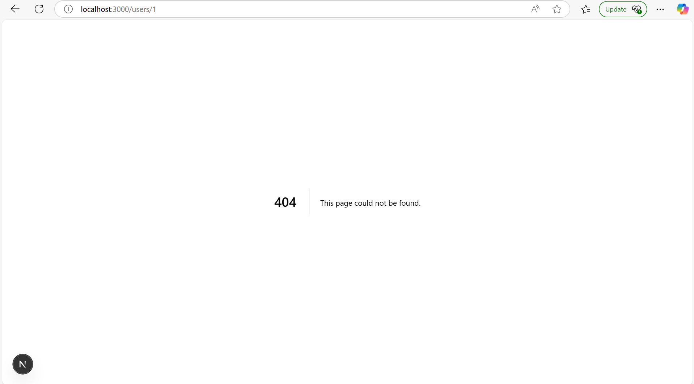

# LAPORAN PRAKTIKUM 3 

|        |   Pemrograman Berbasis Framework   |
|--------|------------------------------------|
|Nama    | Ratnasari                          |
|NIM     | 2241720007                         |
|Kelas   | TI-3B                              |
|Absen   | 18                                 |
|Tugas   | Pertemuan  5                       |

# LANGKAH-LANGKAH PRAKTIKUM 3
## 1. Persiapan Lingkungan


hasil : 


## 2. Membuat Halaman dengan Server-Side Rendering (SSR)


hasil :


## 3. Menggunakan Static Site Generation (SSG)


hasil :


## 4. Menggunakan Dynamic Routes


hasil :


## 5. Menggunakan API Routes


## 6. Menggunakan Link Component


tambahan di file ini 


hasil :


# TUGAS 
## 1. Buat halaman baru dengan menggunakan Static Site Generation (SSG) yang menampilkan daftar pengguna dari API https://jsonplaceholder.typicode.com/users.
- buat direktori users pada direktori pages
- buat file dengan nama index.js
```dart
import Link from 'next/link';

const UsersPage = ({ users }) => {
    return(
        <div>
            <h1>Daftar Pengguna</h1>
            <ul>
                {users.map((user) => (
                    <li key={user.id}>
                        <Link href={`/users/${user.id}`}>{user.name}</Link>
                    </li>
                ))}
            </ul>
        </div>
    );
};

export async function getStaticProps() {
    const res = await fetch('https://jsonplaceholder.typicode.com/users');
    const users = await res.json(); 

    return {
        props: {
            users, 
        },
    };
}


export default UsersPage;
```



hasil :




## 2. Implementasikan Dynamic Routes untuk menampilkan detail pengguna berdasarkan ID.
- buat file dengan nama [id].js di direktori pages/users
``` dart
// pages/users/[id].js
export async function getStaticPaths() {
    const res = await fetch("https://jsonplaceholder.typicode.com/users");
    const users = await res.json();

    const paths = users.map((user) => ({
        params: { id: user.id.toString() }, // ID harus string
    }));

    return { paths, fallback: false }; // Tidak akan mem-build path yang tidak ada
}

export async function getStaticProps({ params }) {
    const res = await fetch(`https://jsonplaceholder.typicode.com/users/${params.id}`);
    const user = await res.json();

    return { props: { user } };
}

const UserDetail = ({ user }) => {
    return (
        <div>
            <h1>{user.name}</h1>
            <p>Email: {user.email}</p>
            <p>Website: {user.website}</p>
            <p>Company: {user.company.name}</p>
        </div>
    );
};

export default UserDetail;
```


hasil :


## 3. Buat API route yang mengembalikan data cuaca dari API eksternal (misalnya, OpenWeatherMap) dan tampilkam data tersebut di halaman front-end.
- buat file weather.js di pages/api
``` dart
export default async function handler(req, res) {
    const { city } = req.query;

    if (!city) {
        return res.status(400).json({ error: "Nama kota diperlukan" });
    }

    try {
        console.log(`🔍 Mencari koordinat untuk kota: ${city}`);

        // Ambil koordinat kota
        const geoResponse = await fetch(
            `https://geocoding-api.open-meteo.com/v1/search?name=${encodeURIComponent(city)}&count=1`
        );
        const geoData = await geoResponse.json();
        console.log("📍 Data Geocoding:", geoData);

        if (!geoData.results || geoData.results.length === 0) {
            return res.status(404).json({ error: "Kota tidak ditemukan" });
        }

        const { latitude, longitude } = geoData.results[0];

        // Ambil data cuaca berdasarkan koordinat
        const weatherResponse = await fetch(
            `https://api.open-meteo.com/v1/forecast?latitude=${latitude}&longitude=${longitude}&current_weather=true`
        );

        const weatherData = await weatherResponse.json();
        console.log("🌦️ Data Cuaca:", weatherData);

        res.status(200).json(weatherData);
    } catch (error) {
        console.error("❌ Error fetching weather data:", error);
        res.status(500).json({ error: "Gagal mengambil data cuaca" });
    }
}
```

- buat file weather.js di pages
``` dart
import React, { useState } from "react";

const weatherDescriptions = {
    0: "Cerah",
    1: "Sebagian cerah",
    2: "Berawan sedikit",
    3: "Berawan",
    45: "Kabut",
    48: "Kabut beku",
    51: "Gerimis ringan",
    53: "Gerimis sedang",
    55: "Gerimis lebat",
    61: "Hujan ringan",
    63: "Hujan sedang",
    65: "Hujan lebat",
    71: "Salju ringan",
    73: "Salju sedang",
    75: "Salju lebat",
    80: "Hujan lokal ringan",
    81: "Hujan lokal sedang",
    82: "Hujan lokal lebat",
    95: "Badai petir ringan",
    96: "Badai petir dengan hujan es",
    99: "Badai petir dengan hujan es",
};

const Weather = () => {
    const [city, setCity] = useState("Malang");
    const [weather, setWeather] = useState(null);
    const [error, setError] = useState("");

    const fetchWeather = async () => {
        try {
            setError("");
            console.log(`🔍 Mencari cuaca untuk kota: ${city}`);

            const response = await fetch(`/api/weather?city=${encodeURIComponent(city)}`);
            const data = await response.json();
            console.log("🌍 API Response:", data);

            if (data.error) {
                setError(data.error);
                setWeather(null);
            } else {
                setWeather(data.current_weather);
            }
        } catch (error) {
            console.error("❌ Fetch error:", error);
            setError("Terjadi kesalahan saat mengambil data.");
        }
    };

    return (
        <div>
            <h1>Cuaca Saat Ini</h1>
            <input
                type="text"
                value={city}
                onChange={(e) => setCity(e.target.value)}
                placeholder="Masukkan nama kota"
            />
            <button onClick={fetchWeather}>Cari Cuaca</button>

            {error && <p style={{ color: "red" }}>❌ {error}</p>}

            {weather ? (
                <div>
                    <p><strong>Suhu:</strong> {weather.temperature}°C</p>
                    <p><strong>Kecepatan Angin:</strong> {weather.windspeed} km/jam</p>
                    <p><strong>Kondisi:</strong> {weatherDescriptions[weather.weathercode] || "Tidak diketahui"}</p>
                </div>
            ) : (
                <p>Masukkan nama kota untuk melihat cuaca.</p>
            )}
        </div>
    );
};

export default Weather;
```
- hasil :


- hasil jika salah inputan 
