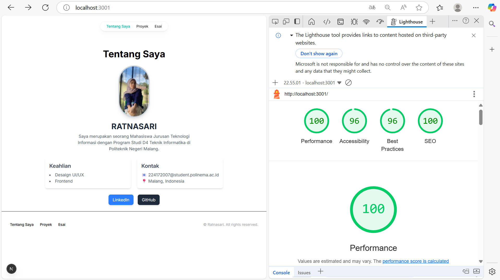

# LAPORAN PRAKTIKUM 10
## Membuat Halaman yang SEO-Friendly dengan Next.js

|        |   Pemrograman Berbasis Framework   |
|--------|------------------------------------|
|Nama    | Ratnasari                          |
|NIM     | 2241720007                         |
|Kelas   | TI-3B                              |
|Absen   | 18                                 |
|Tugas   | Pertemuan  10                      |

# LANGKAH-LANGKAH PRAKTIKUM 
## 1. Menambahkan Favicon

## 2. Menambahkan Metadata untuk SEO dan Open Graph Tags untuk Media Sosial

## 3. Menguji SEO
    - Tentang Saya

  

    - Project

  

    - Esai
  

# Tugas
Lakukan pengujian SEO dengan
## 1.	Gunakan tools seperti Google Search Console untuk memeriksa performa SEO dari suatu website.
pada lighouse atur seperti digambar.

    - Tentang Saya

    - Project

    - Esai
