# LAPORAN PRAKTIKUM 5 

|        |   Pemrograman Berbasis Framework   |
|--------|------------------------------------|
|Nama    | Ratnasari                          |
|NIM     | 2241720007                         |
|Kelas   | TI-3B                              |
|Absen   | 18                                 |
|Tugas   | Pertemuan  6                       |

# LANGKAH-LANGKAH PRAKTIKUM 5
## 1. Persiapan Lingkungan
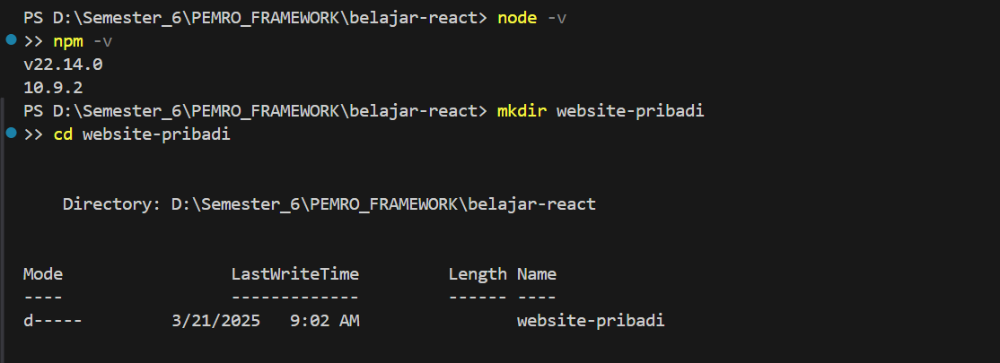
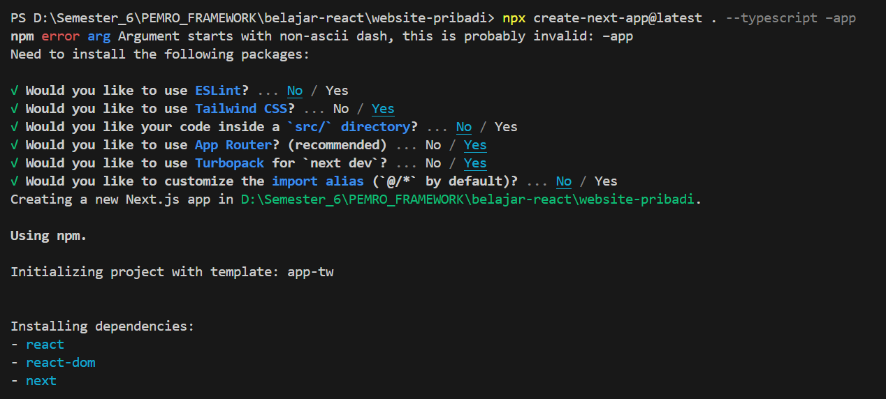
Output :

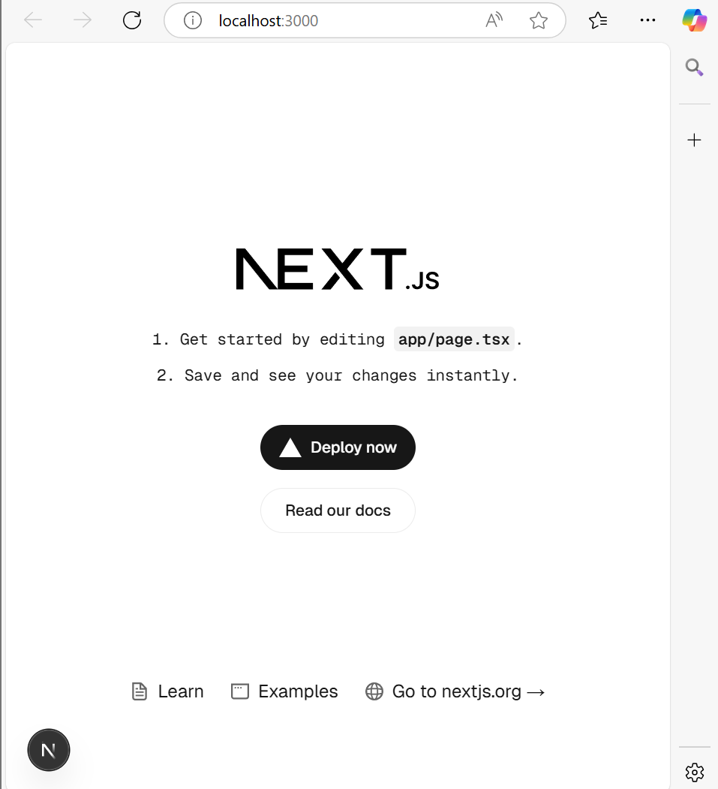

## 2. Membuat Halamn Website
Output :
- Tentang Saya
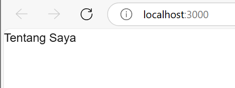

- Proyek 
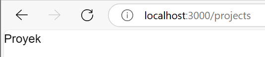

- Esai
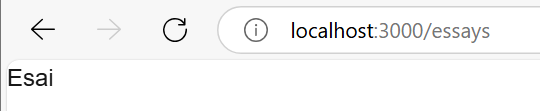

## 3. Membuat Layout dan Navigasi
kode pada components :
- Layout.tsx
```dart
import Head from 'next/head';
import Navbar from './Navbar';
import Footer from './Footer';

type LayoutProps = {
    children: React.ReactNode;
};

export default function Layout({ children }: LayoutProps){
    return (
        <>
            <Head>
                <link rel="icon" href="/favicon.ico" />
            </Head>
            <Navbar />
                <main>{children}</main>
            <Footer/>
        </>
    )
}
```
- Navbar.tsx
```dart
'use client';

import { usePathname } from 'next/navigation';
import image1 from '../../../public/images/project1.png';
import image2 from '../../../public/images/project2.png';

type NavItemProps = {
    title: string;
    url: string;
    isSelected: boolean;
};

function NavItem({ title, url, isSelected }: NavItemProps) {
    return (
        <li>
            <a 
                className={`block px-3 py-2 transition hover:text-teal-500 ${
                    isSelected ? "text-teal-500" : ""
                }`}
                href={url}
            >
                {title}
            </a>
        </li>
    );
}

export default function Navbar(){
    const pathname = usePathname();

    return (
        <div className="flex justify-center mx-auto max-w-7xl h-16 pt-6">
            <nav>
                <ul className="flex rounded-full bg-white/90 px-3 text-sm font-medium text-zinc-800 shadow-lg shadow-zinc-800/5 ring-1 ring-zinc-900/5 backdrop-blur">
                    <NavItem
                        title="Tentang Saya"
                        url="/"
                        isSelected={pathname === '/'}
                    />
                    <NavItem
                        title="Proyek"
                        url="/projects"
                        isSelected={pathname === '/projects'}
                    />
                    <NavItem
                        title="Esai"
                        url="/essays"
                        isSelected={pathname === '/essays'}
                    />
                </ul>
            </nav>
        </div>
    );
}
```
- Footer.tsx
```dart
type FooterLinkProps = {
    text: string;
    url: string;
};

function FooterLink({ text, url }: FooterLinkProps) {
    return (
        <a className="text-black transition hover:text-teal-500" href={url}>
            {text}
        </a>
    );
}

export default function Footer() {
    return (
        <footer className="pt-10 px-8 pb-16 border-t">
            <div className="flex justify-between gap-6">
                {/* Menambahkan text-black agar semua teks di dalam div ini berwarna hitam */}
                <div className="flex gap-6 text-sm font-medium text-black">
                    <FooterLink text="Tentang Saya" url="/" />
                    <FooterLink text="Proyek" url="/projects" />
                    <FooterLink text="Esai" url="/essays" />
                </div>
                <p className="text-sm text-zinc-400">© Ratnasari. All rights reserved.</p>
            </div>
        </footer>
    );
}

```
app :
- layout.tsx
```dart
import type { Metadata } from "next";
import { Geist, Geist_Mono, Inter } from "next/font/google";
import "./globals.css";
import Layout from "../components/Layout";

const inter = Inter({subsets:['latin']});

export const metadata: Metadata = {
title:'Website Pribadi',
description:'Website pribadi untuk menampilkan proyek dan esai.',
}

const geistSans = Geist({
  variable: "--font-geist-sans",
  subsets: ["latin"],
});

const geistMono = Geist_Mono({
  variable: "--font-geist-mono",
  subsets: ["latin"],
});

export default function RootLayout({
  children,
}: {
  children: React.ReactNode;
}) {
  return (
    <html lang="en">
      <body className={inter.className}><Layout>{children}</Layout>
      </body>
    </html>
  );
}
```
- page.tsx
```dart
import type {Metadata} from 'next';

export const metadata: Metadata = {
    title: 'Tentang Saya',
    description: 'Halaman tentang saya.',
    openGraph: {
        title: 'Tentang Saya',
        description: 'Halaman tentang saya.',
    },
};

export default function Home () {
    return (
        <div className="mt-16 px-8">
            <header>
                <h1 className="font-bold text-4x1 text-zinc-800">Tentang Saya</h1>
            </header>
        </div>
    );
}
```
Output :
- Tentang Saya
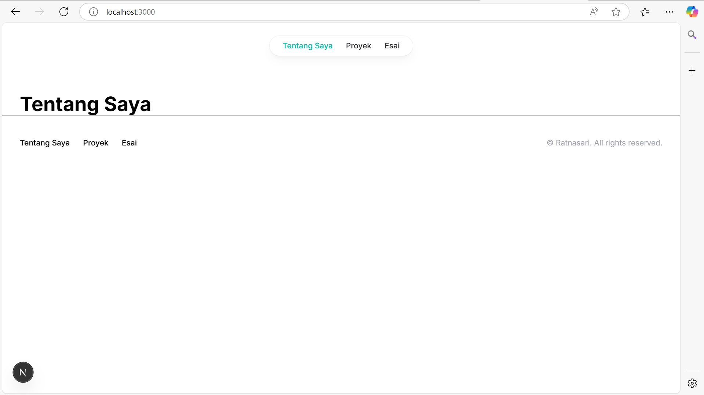

- Proyek 
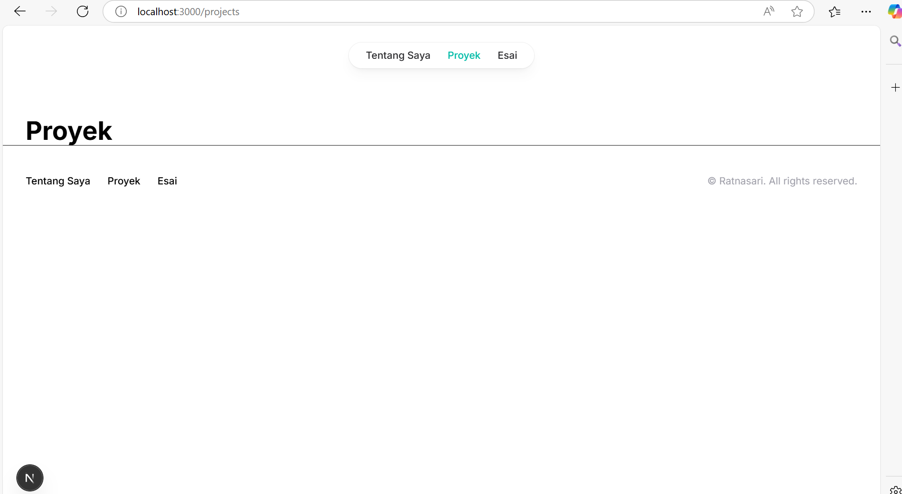

- Esai
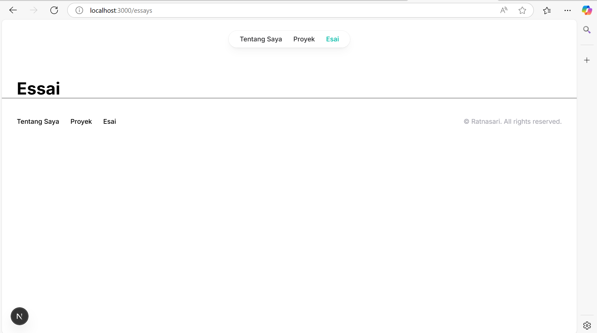


## 4. Membuat Halaman Proyek dengan Grid Responsif
```dart
import type { Metadata } from 'next';
import Image from 'next/image';
export const metadata: Metadata = {
  title: 'Proyek',
  description: 'Halaman Proyek',
  openGraph: {
    title: 'Proyek',
    description: 'Halaman Proyek.',
  },
};

type ProjectItemProps = {
  name: string;
  url: string;
  urlDisplay: string;
  imageSrc: string;
};

function ProjectItem({ name, url, urlDisplay, imageSrc }: ProjectItemProps) {
  return (
    <li>
      <a href={url} className="block text-center">
      <div className="relative w-[200px] min-h-[270px] mx-auto bg-white rounded-2xl shadow-md shadow-lg p-6  flex flex-col items-center justify-center pt-6 gap-y-4">
          <div className="relative w-[150px] h-[150px] mx-auto">
            <Image 
              className="rounded-2xl overflow-hidden object-cover bg-gray-300" 
              src={imageSrc} 
              alt={name} 
              layout="fill"
            />
          </div>
          <div className="mt-4">
            <div className="font-bold text-base text-black">{name}</div>
            <span className="inline-block bg-gray-200 rounded-full px-3 py-1 text-xs font-semibold text-gray-700 mt-2">
              {urlDisplay}
            </span>
          </div>
        </div>
      </a>
    </li>
  );
}

export default function Projects() {
  return (
    <div className="mt-16 px-8">
      <header>
        <h1 className="font-bold text-4xl text-black">Proyek Saya</h1>
        <p className="text-base mt-6 text-zinc-600">
          Berikut adalah beberapa proyek yang telah saya kerjakan.
        </p>
      </header>
      <div className="mt-16">
        <h2 className="text-2xl">Aplikasi</h2>
        <ul className="grid grid-cols-1 md:grid-cols-2 lg:grid-cols-4 gap-x-4 gap-y-8 mt-8 justify-center">
          <ProjectItem name="Aplikasi 1" url="https://example.com" urlDisplay="App Store" imageSrc="/imgp4/project1.png" />
          <ProjectItem name="Aplikasi 2" url="https://example.com" urlDisplay="App Store" imageSrc="/imgp4/project2.png" />
        </ul>
      </div>
    </div>
  );
}

```
Output :

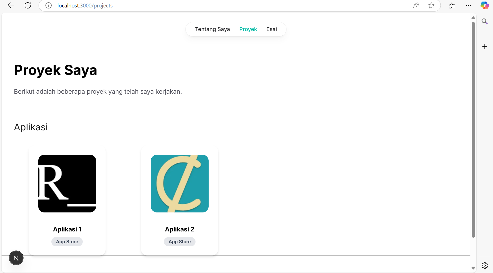


## TUGAS
### 1. Modifikasi halaman "Esai" dengan Grid daftar artikel yang telah ditulis. 
kode :
``` dart
"use client";

import { useState } from "react";

// Daftar Artikel
const essays = [
  { id: 1, title: "Pemrograman Fungsional", content: "Penjelasan lebih lanjut tentang pemrograman fungsional..." },
  { id: 2, title: "Mengenal Tailwind CSS", content: "Tailwind CSS adalah framework CSS yang berbasis utility-first..." },
  { id: 3, title: "Next.js untuk Pemula", content: "Panduan langkah demi langkah untuk memulai proyek dengan Next.js..." },
];

export default function Essays() {
  // State untuk menyimpan artikel yang dipilih
  const [selectedEssay, setSelectedEssay] = useState<{ id: number; title: string; content: string } | null>(null);

  return (
    <div className="mt-16 px-8">
      <header className="mb-8">
        <h1 className="font-bold text-4xl text-black">Essai</h1>
      </header>

      {selectedEssay ? (
        // Tampilan Detail Artikel
        <div className="p-6 bg-white shadow-lg rounded-lg border">
          <button
            onClick={() => setSelectedEssay(null)}
            className="mb-4 px-4 py-2 bg-gray-500 text-white rounded hover:bg-gray-600 transition"
          >
            ← Kembali
          </button>
          <h2 className="text-2xl font-semibold text-gray-800">{selectedEssay.title}</h2>
          <p className="mt-4 text-gray-700">{selectedEssay.content}</p>
        </div>
      ) : (
        // Tampilan Daftar Artikel
        <div className="grid grid-cols-1 md:grid-cols-2 lg:grid-cols-3 gap-6">
          {essays.map((essay) => (
            <div
              key={essay.id}
              className="p-6 bg-white shadow-lg rounded-lg border hover:shadow-xl transition duration-300 cursor-pointer"
              onClick={() => setSelectedEssay(essay)}
            >
              <h2 className="text-xl font-semibold text-gray-800">{essay.title}</h2>
              <p className="text-gray-600 mt-2">{essay.content.substring(0, 50)}...</p>
              <button className="mt-4 px-4 py-2 bg-blue-500 text-white rounded hover:bg-blue-600 transition">
                Baca Selengkapnya
              </button>
            </div>
          ))}
        </div>
      )}
    </div>
  );
}

```
Output : 

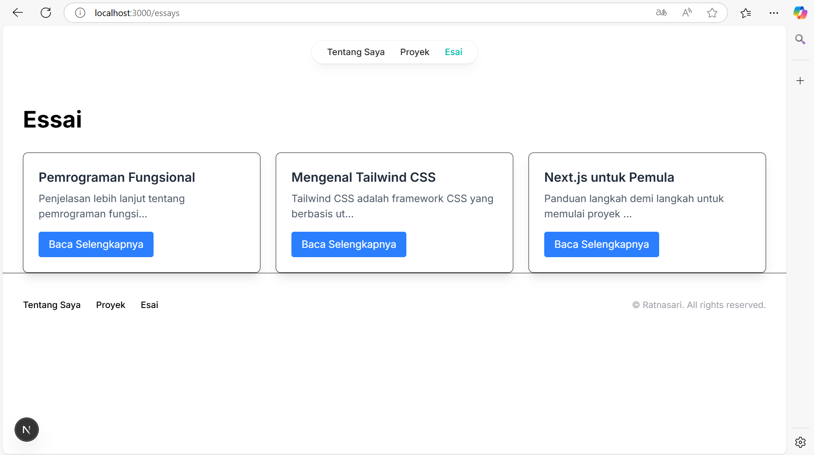
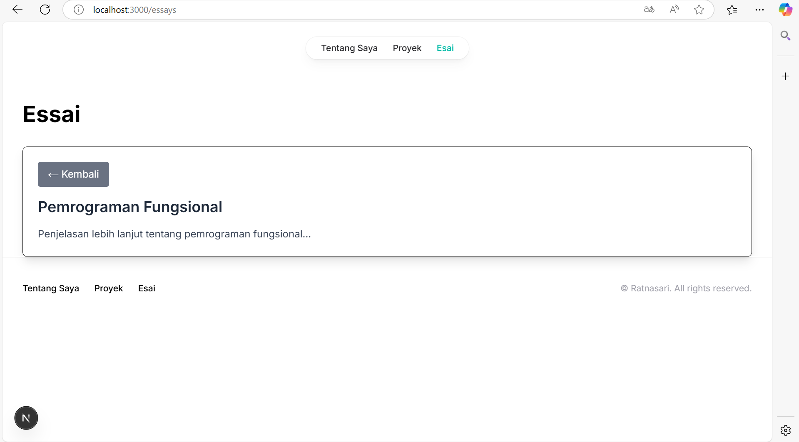

### 2. Modifikasi halaman “Tentang Saya” Buat tampilan yang menarik 
kode :
``` dart
'use client';

export default function Home() {
  return (
    <div className="flex flex-col items-center mt-16 px-8">
     <h1 className="font-bold text-4xl text-black">Tentang Saya</h1><br />
      
      <h1 className="mt-4 text-3xl font-bold text-gray-800">RATNASARI</h1>
      <p className="text-gray-600 text-center mt-2 max-w-md">
        Saya merupakan seorang Mahasiswa Jurusan Teknologi Informasi dengan Program Studi D4 Teknik Informatika di Politeknik Negeri Malang.
      </p> 
      <div className="mt-6 grid grid-cols-1 md:grid-cols-2 gap-6">
        <div className="p-4 bg-white shadow-md rounded-lg">
          <h2 className="text-xl font-semibold text-gray-700">Keahlian</h2>
          <ul className="list-disc list-inside text-gray-600 mt-2">
            <li>Desaign UI/UX</li>
            <li>Frontend</li>
          </ul>
        </div>
        <div className="p-4 bg-white shadow-md rounded-lg">
          <h2 className="text-xl font-semibold text-gray-700">Kontak</h2>
          <p className="text-gray-600 mt-2">📧 224172007@student.polinema.ac.id</p>
          <p className="text-gray-600">📍 Malang, Indonesia</p>
        </div>
      </div>
      <div className="mt-6 flex space-x-4">
        <a
          href="https://linkedin.com/in/ratnasari124"
          className="px-4 py-2 bg-blue-500 text-white rounded-lg shadow-md hover:bg-blue-600 transition"
          target="_blank"
        >
          LinkedIn
        </a>
        <a
          href="https://github.com/ratnasari124"
          className="px-4 py-2 bg-gray-800 text-white rounded-lg shadow-md hover:bg-gray-900 transition"
          target="_blank"
        >
          GitHub
        </a>
      </div><br />
    </div>
  );
}
```
Output : 

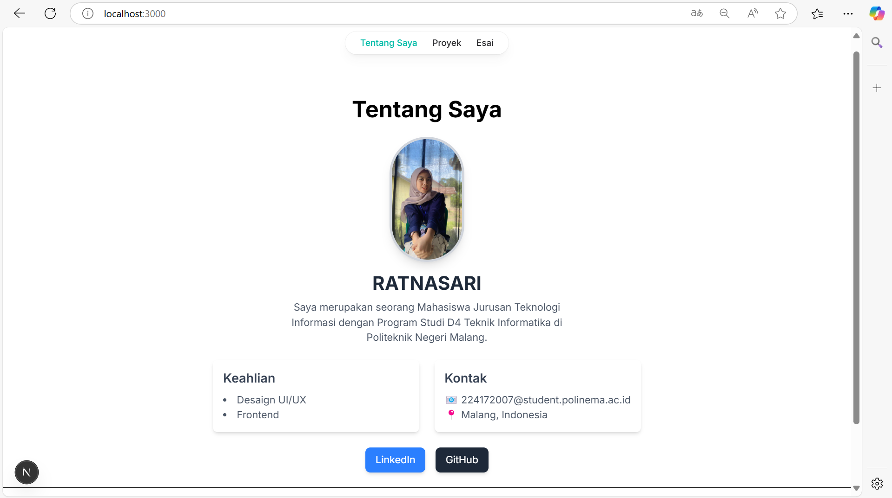
